# Vi,Java,Ant,Junit的自学报告

18342138 郑卓民

<!-- TOC -->

- [Vi,Java,Ant,Junit的自学报告](#vijavaantjunit的自学报告)
  - [Vi](#vi)
    - [简介](#简介)
    - [Vi/Vim基本使用](#vivim基本使用)
    - [Vi/Vim中模式的切换总结：](#vivim中模式的切换总结)
    - [简单案例：](#简单案例)
  - [Java](#java)
    - [简介：](#简介-1)
    - [主要特性](#主要特性)
    - [Linux下Java环境的配置](#linux下java环境的配置)
    - [HelloWorld](#helloworld)
      - [使用vim加命令行来运行：](#使用vim加命令行来运行)
      - [使用Eclipse创建项目并运行：](#使用eclipse创建项目并运行)
      - [Java GUI](#java-gui)
      - [Java小程序——简单计算器](#java小程序简单计算器)
  - [Ant](#ant)
    - [简介](#简介-2)
    - [配置](#配置)
    - [Ant入门](#ant入门)
    - [Ant之project、target、property](#ant之projecttargetproperty)
    - [HelloWorld项目的ant编写](#helloworld项目的ant编写)
  - [Junit](#junit)
    - [简介](#简介-3)
    - [基础使用](#基础使用)
    - [原则](#原则)
    - [HelloWorld项目的Junit测试](#helloworld项目的junit测试)

<!-- /TOC -->

## Vi

### 简介

所有的 Unix Like 系统都会内建 vi 文书编辑器，其他的文书编辑器则不一定会存在。vim 具有程序编辑的能力，可以主动的以字体颜色辨别语法的正确性，方便程序设计。

### Vi/Vim基本使用

基本上 vi/vim 共分为三种模式，分别是**命令模式（Command mode）**，**输入模式（Insert mode）**和**底线命令模式（Last line mode）**。 

1. 命令模式：
用户刚刚启动 vi/vim，便进入了命令模式。此状态下敲击键盘动作会被Vim识别为命令，而非输入字符。比如我们此时按下i，并不会输入一个字符，i被当作了一个命令。以下是常用的几个命令：
   - i 切换到输入模式，以输入字符。
   - x 删除当前光标所在处的字符。
   - : 切换到底线命令模式，以在最底一行输入命令。

> 若想要编辑文本：启动Vim，进入了命令模式，按下i，切换到输入模式。          
> 命令模式只有一些最基本的命令，因此仍要依靠底线命令模式输入更多命令。

2. 输入模式:
在命令模式下按下i就进入了输入模式。在输入模式中，可以使用以下按键：
   - 字符按键以及Shift组合，输入字符
   - ENTER，回车键，换行
   - BACK SPACE，退格键，删除光标前一个字符
   - DEL，删除键，删除光标后一个字符
   - 方向键，在文本中移动光标
   - HOME/END，移动光标到行首/行尾
   - Page Up/Page Down，上/下翻页
   - Insert，切换光标为输入/替换模式，光标将变成竖线/下划线
   - ESC，退出输入模式，切换到命令模式

3. 底线命令模式:
在命令模式下按下:（英文冒号）就进入了底线命令模式。底线命令模式可以输入单个或多个字符的命令，可用的命令非常多。在底线命令模式中，基本的命令有（已经省略了冒号）：
   - q 退出程序
   - w 保存文件

> 按ESC键可随时退出底线命令模式。

### Vi/Vim中模式的切换总结：

三个模式：命令模式、输入模式、底线命令模式

- 进入命令模式：使用vi filename 或vim filename
- 命令模式进入输入模式：输入i、a、o。
- 输入模式返回命令模式：ESC键
- 命令模式进入底线命令模式：输入“：”
- 底线命令模式返回命令模式：ESC键
- 退出命令模式：输入“：”进入底线命令模式，输入wq回车，保存并离开。

### 简单案例：

首先创建了一个vim_test.txt文件，然后使用vim编辑器进行编辑，输入i进入输入模式。

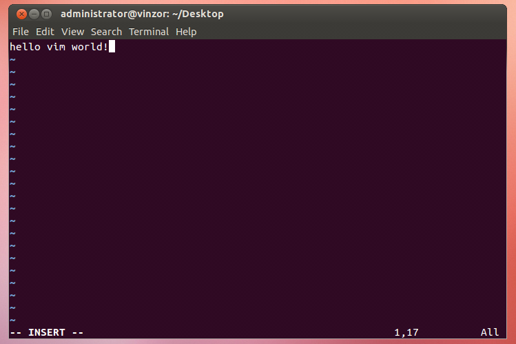

然后输入完后，esc加：进入底层命令模式，然后wq保存退出。

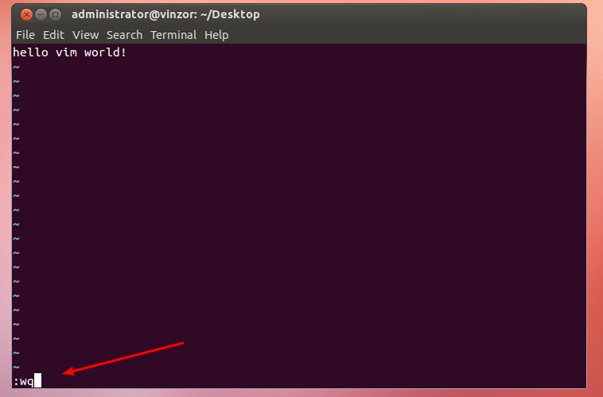

最后使用cat查看文件内容。

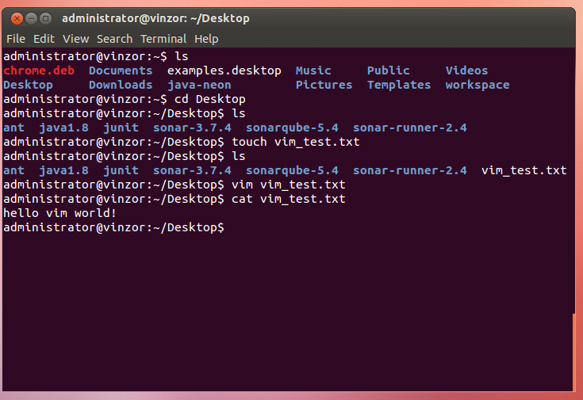

## Java

### 简介：

Java是一门面向对象编程语言，不仅吸收了C++语言的各种优点，还摒弃了C++里难以理解的多继承、指针等概念，因此Java语言具有功能强大和简单易用两个特征。Java语言作为静态面向对象编程语言的代表，极好地实现了面向对象理论，允许程序员以优雅的思维方式进行复杂的编程。

Java具有简单性、面向对象、分布式、健壮性、安全性、平台独立与可移植性、多线程、动态性等特点。Java可以编写桌面应用程序、Web应用程序、分布式系统和嵌入式系统应用程序等。

### 主要特性

1. Java 语言是简单的：

Java 语言的语法与 C 语言和 C++ 语言很接近，使得大多数程序员很容易学习和使用。另一方面，Java 丢弃了 C++ 中很少使用的、很难理解的、令人迷惑的那些特性，如操作符重载、多继承、自动的强制类型转换。特别地，Java 语言不使用指针，而是引用。并提供了自动分配和回收内存空间，使得程序员不必为内存管理而担忧。

2. Java 语言是面向对象的：

Java 语言提供类、接口和继承等面向对象的特性，为了简单起见，只支持类之间的单继承，但支持接口之间的多继承，并支持类与接口之间的实现机制（关键字为 implements）。Java 语言全面支持动态绑定，而 C++语言只对虚函数使用动态绑定。总之，Java语言是一个纯的面向对象程序设计语言。

3. Java语言是分布式的：

Java语 言支持 Internet 应用的开发，在基本的 Java 应用编程接口中有一个网络应用编程接口（java net），它提供了用于网络应用编程的类库，包括 URL、URLConnection、Socket、ServerSocket 等。Java 的 RMI（远程方法激活）机制也是开发分布式应用的重要手段。

4. Java 语言是健壮的：
Java 的强类型机制、异常处理、垃圾的自动收集等是 Java 程序健壮性的重要保证。对指针的丢弃是 Java 的明智选择。Java 的安全检查机制使得 Java 更具健壮性。

5. Java语言是安全的：

Java通常被用在网络环境中，为此，Java 提供了一个安全机制以防恶意代码的攻击。除了Java 语言具有的许多安全特性以外，Java 对通过网络下载的类具有一个安全防范机制（类 ClassLoader），如分配不同的名字空间以防替代本地的同名类、字节代码检查，并提供安全管理机制（类 SecurityManager）让 Java 应用设置安全哨兵。

6. Java 语言是体系结构中立的：

Java 程序（后缀为 java 的文件）在 Java 平台上被编译为体系结构中立的字节码格式（后缀为 class 的文件），然后可以在实现这个 Java 平台的任何系统中运行。这种途径适合于异构的网络环境和软件的分发。

7. Java 语言是可移植的：

这种可移植性来源于体系结构中立性，另外，Java 还严格规定了各个基本数据类型的长度。Java 系统本身也具有很强的可移植性，Java 编译器是用 Java 实现的，Java 的运行环境是用 ANSI C 实现的。

8. Java 语言是解释型的：

如前所述，Java 程序在 Java 平台上被编译为字节码格式，然后可以在实现这个 Java 平台的任何系统中运行。在运行时，Java 平台中的 Java 解释器对这些字节码进行解释执行，执行过程中需要的类在联接阶段被载入到运行环境中。

9. Java 是高性能的：

与那些解释型的高级脚本语言相比，Java 的确是高性能的。事实上，Java 的运行速度随着 JIT(Just-In-Time）编译器技术的发展越来越接近于 C++。

10. Java 语言是多线程的：

在 Java 语言中，线程是一种特殊的对象，它必须由 Thread 类或其子（孙）类来创建。通常有两种方法来创建线程：其一，使用型构为 Thread(Runnable) 的构造子类将一个实现了 Runnable 接口的对象包装成一个线程，其二，从 Thread 类派生出子类并重写 run 方法，使用该子类创建的对象即为线程。值得注意的是 Thread 类已经实现了 Runnable 接口，因此，任何一个线程均有它的 run 方法，而 run 方法中包含了线程所要运行的代码。线程的活动由一组方法来控制。Java 语言支持多个线程的同时执行，并提供多线程之间的同步机制（关键字为 synchronized）。

11. Java 语言是动态的：

Java 语言的设计目标之一是适应于动态变化的环境。Java 程序需要的类能够动态地被载入到运行环境，也可以通过网络来载入所需要的类。这也有利于软件的升级。另外，Java 中的类有一个运行时刻的表示，能进行运行时刻的类型检查。

### Linux下Java环境的配置

- 查看java的版本

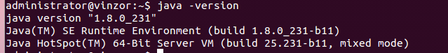

- java环境变量的配置：
  - JAVA_HOME：指向jdk安装目录，该目录下有bin、lib目录。
  - PATH：系统原有的变量，指向命令搜索路径，在shell下执行命令时，它会到PATH变量制定的路径中查找相应的命令。
  - CLASSPATH：指向类搜索路径。通过该变量来寻找并使用类。

具体配置需要在bashrc文件中加入如下代码（根据实际进行修改：版本等信息），并更新配置（使用source命令）：

```shell
export JAVA_HOME=/usr/local/jdk1.8.0_222
export PATH=$JAVA_HOME/bin:$PATH
export CLASSPATH=.:$JAVA_HOME/lib/dt.jar:$JAVA_HOME/lib/tools.jar
```

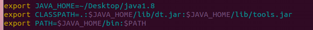

### HelloWorld

尝试使用Helloworld程序来体验java回顾编写与运行的整个流程。

#### 使用vim加命令行来运行：

使用javac和java命令，出现could not find的问题时候，参见上面我说的配置profile。

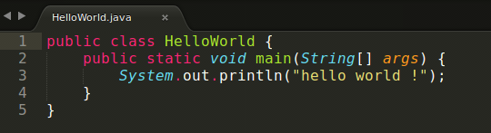

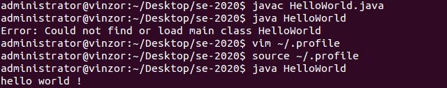

#### 使用Eclipse创建项目并运行：

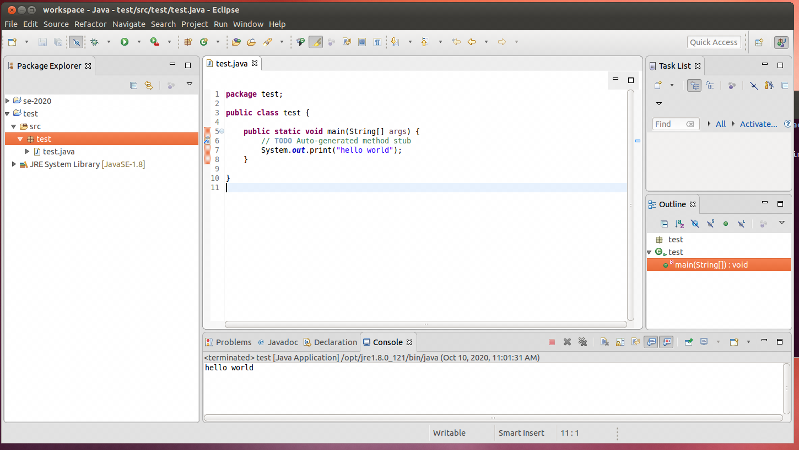

#### Java GUI

GUI开发的三个主要包:
- java.awt 包 – 主要提供字体/布局管理器
- javax.swing 包(商业开发常用) – 主要提供各种组件(窗口/按钮/文本框)
- java.awt.event 包 – 事件处理，后台功能的实现。

Swing组件：
- 顶层容器：常用有JFrame，JDialog
- 中间容器：JPanel，JOptionPane，JScrollPane，JLayeredPane 等，主要以panel结尾。
- 基本组件：JLabel，JButton，JTextField，JPasswordField，JRadioButton 等。

#### Java小程序——简单计算器

整体实现思路与原理：
1. 需要用到JAVA GUI的JFrame、JLabel、JTextField、JButton等组件
2. 界面的布局需要用到GridLayout布局。
3. 给button添加事件处理，使用addActionListener
4. 计算器的运行逻辑，输入两个数，选择运算规则（加减乘除），计算结果。

实现逻辑见代码注释：

```java
import javax.swing.*;
import java.awt.*;
import java.awt.event.ActionEvent;
import java.awt.event.ActionListener;


public class Calculator extends JFrame implements ActionListener {
    // data variable
    private double num1;     // the first number to do compute
    private double num2;     // the second number to do compute
    private int mode = -1;   // get the operation symbol type

    // GUI variable
    private JLabel jlb1, jlb2, jlb3;            // label: operation symbol/ =/ result
    private JTextField jtf1, jtf2;              // textfield: num1 / num2
    private JButton jb1, jb2, jb3, jb4, jb5;    // button: + - * / OK

    public static void main(String[] args) {
        Calculator myCalculator = new Calculator(); // start Calculator
    }

    public Calculator(){
        // set the component:
        // set the component jlb1
        jlb1 = new JLabel(" ");
        jlb1.setHorizontalAlignment(JTextField.CENTER);
        jlb1.setBorder(BorderFactory.createLineBorder(Color.black));
        
        // set the component jlb2
        jlb2 = new JLabel("=");
        jlb2.setHorizontalAlignment(JTextField.CENTER);
        jlb2.setBorder(BorderFactory.createLineBorder(Color.black));
        
        // set the component jlb3
        jlb3 = new JLabel(" ");
        jlb3.setHorizontalAlignment(JTextField.CENTER);
        jlb3.setBorder(BorderFactory.createLineBorder(Color.black));

        // set the component jtf1
        jtf1 = new JTextField(0);
        jtf1.setHorizontalAlignment(JTextField.CENTER);

        // set the component jtf2
        jtf2 = new JTextField(0);
        jtf2.setHorizontalAlignment(JTextField.CENTER);
        
        // set the component jb1
        jb1 = new JButton("+");
        jb1.addActionListener(this);
        
        // set the component jb2
        jb2 = new JButton("-");
        jb2.addActionListener(this);
        
        // set the component jb3
        jb3 = new JButton("*");
        jb3.addActionListener(this);
        
        // set the component jb4
        jb4 = new JButton("/");
        jb4.addActionListener(this);
        
        // set the component jb5
        jb5 = new JButton("OK");
        jb5.addActionListener(this);

        // add the component
        this.add(jtf1);
        this.add(jlb1);
        this.add(jtf2);
        this.add(jlb2);
        this.add(jlb3);
        this.add(jb1);
        this.add(jb2);
        this.add(jb3);
        this.add(jb4);
        this.add(jb5);

        // set the window
        this.setLayout(new GridLayout(2,5));
        this.setTitle("Easy Calculator");
        this.setSize(500,200);
        this.setLocation(400,400);
        this.setDefaultCloseOperation(JFrame.EXIT_ON_CLOSE);
        // make it visible
        this.setVisible(true);
    }

    @Override
    public void actionPerformed(ActionEvent e){ // override the actionPerformed
        // set the action of button
        if(e.getActionCommand().equals("+")){
            jlb1.setText("+");
            mode = 0;
        } else if(e.getActionCommand().equals("-")){
            jlb1.setText("-");
            mode = 1;
        } else if(e.getActionCommand().equals("*")){
            jlb1.setText("*");
            mode = 2;
        } else if(e.getActionCommand().equals("/")){
            jlb1.setText("/");
            mode = 3;
        } else if(e.getActionCommand().equals("OK")){
            try {
                num1 = Double.parseDouble(jtf1.getText());
                num2 = Double.parseDouble(jtf2.getText());
                double result = 0.0;
                String s = "";
                if (mode == 0) {
                    result = num1 + num2;
                    s = "" + result;
                }
                else if (mode == 1) {
                    result = num1 - num2;
                    s = "" + result;
                } 
                else if (mode == 2) {
                    result = num1 * num2;
                    s = "" + result;
                }
                else if (mode == 3){
                    // catch the exception like : operation == "/" and num2 == 0
                    if(num2 == 0) {
                        JOptionPane.showMessageDialog(null,"Divisor cannot be zero!", "WARNING", JOptionPane.WARNING_MESSAGE);
                    } else {
                        result = num1 / num2;
                        s = "" + result;
                    }
                }
                else {
                    // mode == -1 : no operation symbol
                    JOptionPane.showMessageDialog(null,"Need a operation symbol!", "WARNING", JOptionPane.WARNING_MESSAGE);
                }
                jlb3.setText(s);
            } catch (Exception er) {
                // catch other exception unpredictable, like : getText() wrong
                JOptionPane.showMessageDialog(null,"Input invalid!", "WARNING", JOptionPane.WARNING_MESSAGE);
            }
            
        }
    }
}
```

效果如下：

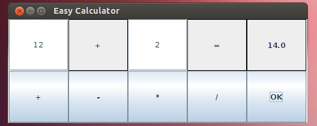

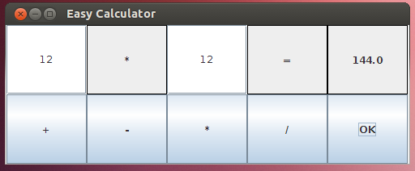

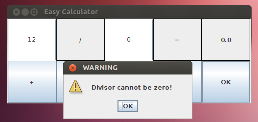

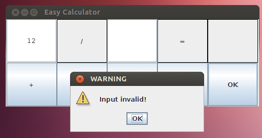

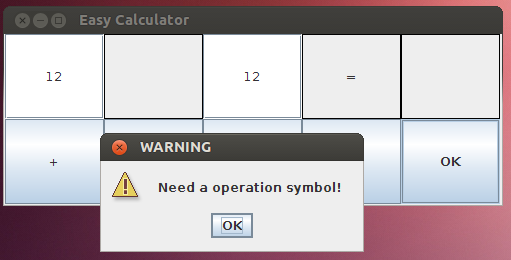

## Ant

### 简介

- Ant是Java的生成工具，是Apache的核心项目；
- Ant类似于Unix中的Make工具，都是用来编译、生成；
- Ant是跨平台的，而Make不能；
- Ant的主要目的就是把你想做的事情自动化，不用你手动一步一步做，因为里面内置了javac、java、创建目录、复制文件等功能，所以可以直接点击Ant文件，即可编译生成你的项目。

### 配置

- 在Ant安装之前需要安装好JDK，并配置好JAVA_HOME；
- 新建环境变量ANT_HOME：值为ANT的主目录；
- 在path中配置%ANT_HOME%/bin；
- 配置完成之后，打开命令行，输入ant，当出现“Buildfile: build.xml does not exist! Build failed”时说明配置完成；

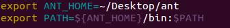

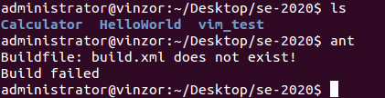

### Ant入门

ant的默认生成文件为build.xml；

输入ant后，ant会在当前目录下搜索是否有build.xml，如果有，则执行；

整体结构为：

```xml
<?xml version="1.0" encoding="GBK"?>  
<project default="targetname">  
    <target name="name">  
    </target>  
</project>
```

- project是生成文件的根元素，表示一个工程；
- target是project的子元素，表示一个任务；一个project中可以定义多个target元素，表示多个任务；
- default属性表示默认执行的target，如果ant命令没有指定target，则执行default的target；
- ant targetname; 则会执行此target，而忽略default设置的target；targetname不能重复。

### Ant之project、target、property

- project元素
  - project元素是Ant构件文件的根元素，Ant构件文件至少应该包含一个project元素，否则会发生错误。以下是project元素的各属性：
    - name属性：用于指定project元素的名称。
    - default属性：用于指定project默认执行时所执行的target的名称。
    - basedir属性：用于指定基路径的位置。
- target元素
  - 它为Ant的基本执行单元，它可以包含一个或多个具体的任务。它有如下属性：
    - name属性：指定target元素的名称，这个属性在一个project元素中是唯一的。
    - depends属性：用于描述target之间的依赖关系，若与多个target存在依赖关系时，需要以“,”间隔。Ant会依照depends属性中target出现的顺序依次执行每个target。被依赖的target会先执行。
    - if属性：用于验证指定的属性是否存在，若不存在，所在target将不会被执行。
    - unless属性：该属性的功能与if属性的功能正好相反，它也用于验证指定的属性是否存在，若不存在，所在target将会被执行。
    - description属性：该属性是关于target功能的简短描述和说明。
- property元素
  - 该元素可看作参量或者参数的定义，project的属性可以通过property元素来设定，也可在Ant之外设定。
  - property元素可用作task的属性值。在task中是通过将属性名放在“${”和“}”之间，并放在task属性值的位置来实现的。

### HelloWorld项目的ant编写

```xml
<?xml version="1.0" ?> 
<project name ="HelloWorld" default="run" basedir="."> 
    <target name="clean"> 
        <delete dir="${basedir}/build"/> 
    </target> 
    <target name="compile"  depends ="clean"> 
        <mkdir dir ="${basedir}/build/classes"/> 
        <javac srcdir ="${basedir}/src" destdir ="${basedir}/build/classes"/> 
    </target> 
     <target name="run"  depends ="compile"> 
        <java classname ="HelloWorld"> 
            <classpath> 
               <pathelement path="${basedir}/build/classes"/> 
            </classpath> 
        </java> 
    </target> 
</project> 
```

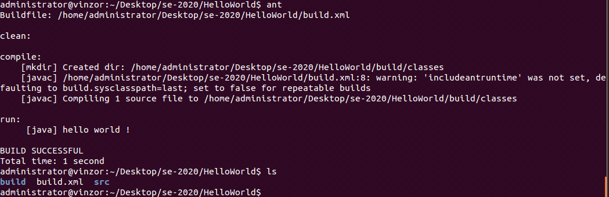

## Junit

### 简介

JUnit是一个Java语言的单元测试框架。它由Kent Beck和Erich Gamma建立，逐渐成为源于Kent Beck的sUnit的xUnit家族中最为成功的一个。 JUnit有它自己的JUnit扩展生态圈。多数Java的开发环境都已经集成了JUnit作为单元测试的工具。 

JUnit是由 Erich Gamma 和 Kent Beck 编写的一个回归测试框架（regression testing framework）。Junit测试是程序员测试，即所谓白盒测试，因为程序员知道被测试的软件如何（How）完成功能和完成什么样（What）的功能。Junit是一套框架，继承TestCase类，就可以用Junit进行自动测试了。

### 基础使用

1. @Test: 测试方法
   1. (expected=XXException.class)如果程序的异常和XXException.class一样，则测试通过
   2. (timeout=100)如果程序的执行能在100毫秒之内完成，则测试通过
2. @Ignore: 被忽略的测试方法：加上之后，暂时不运行此段代码
3. @Before: 每一个测试方法之前运行
4. @After: 每一个测试方法之后运行
5. @BeforeClass: 方法必须必须要是静态方法（static 声明），所有测试开始之前运行，注意区分before，是所有测试方法
6. @AfterClass: 方法必须要是静态方法（static 声明），所有测试结束之后运行，注意区分 @After

### 原则

- 测试方法上必须使用@Test进行修饰
- 测试方法必须使用public void 进行修饰，不能带任何的参数
- 建一个源代码目录来存放我们的测试代码，即将测试代码和项目业务代码分开
- 测试类所在的包名应该和被测试类所在的包名保持一致
- 测试单元中的每个方法必须可以独立测试，测试方法间不能有任何的依赖
- 测试类使用Test作为类名的后缀（不是必须）
- 测试方法使用test作为方法名的前缀（不是必须）

### HelloWorld项目的Junit测试

配置bashrc如下：

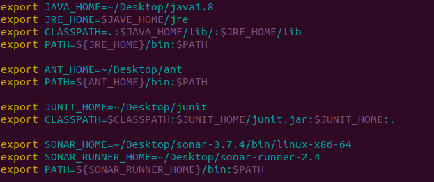

从官网上下载Junit-4.9，并放置在HelloWorld目录下

HelloWorld目录下src文件夹存放HelloWorld.java和HelloWorldTest.java

1. HelloWorld.java

```java
public class HelloWorld {
  public String getStr() {
    return "Hello World!";
  }
  public static void main(String args[]) {
    HelloWorld h = new HelloWorld();
    System.out.println(h.getStr());
  }
}
```

2. HelloWorldTest.java

```java
import static org.junit.Assert.*;
import org.junit.Test;

public class HelloWorldTest {
	@Test
	public void testHello() {
		HelloWorld hw = new HelloWorld();
		assertEquals("Hello World!", hw.getStr());
	}
}
```

3. build.xml

```xml
<?xml version="1.0" encoding="UTF-8"?>

<project name="HelloWorld" default="run">
  <target name="clean">
    <delete dir="build"/>
  </target> 

  <target name="compile" depends="clean">
    <mkdir dir="build/classes"/>
    <javac srcdir="src" destdir="build/classes" includeantruntime="on">
      <classpath>
        <fileset dir="./" includes="**/*.jar"/>
      </classpath>
    </javac>
  </target>

  <target name="run" depends="compile">
    <java classname="HelloWorld">
      <classpath>
        <pathelement path="build/classes"/>
      </classpath>
    </java>
  </target> 

  <target name="junit" depends="compile">
    <junit printsummary="true" fork="true" haltonfailure="false" showoutput="true">
      <classpath>
        <fileset dir="./" includes="**/*.jar"/>
        <pathelement path="build/classes"/>
      </classpath>
      <test name="HelloWorldTest"/>
      <formatter type="xml"/>
      <batchtest>
        <fileset dir="build/classes" includes="**/*Test.*"/>
      </batchtest>
    </junit>
  </target> 

</project>
```

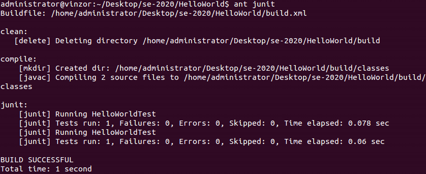